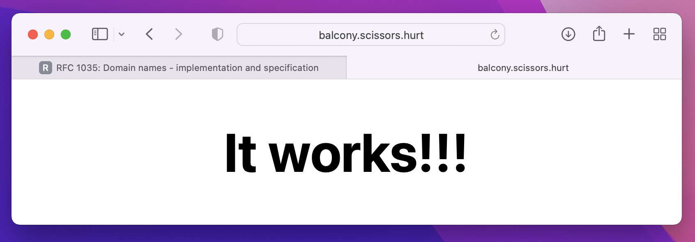

# 📍 what3words (DNS edition)

Toy Go DNS server which resolves IPs based on a three.word.format

**Build the project locally:**

```bash
$ go build .
```

**Translate a domain to its three-word equivalent format:**

```bash
$ ./what3words -t bede.io
balcony.scissors.hurt
```

**Run a DNS server for the three-word format:**

```bash
$ sudo ./what3words -s
Listening on port 53...
```

**Using the DNS server (nslookup):**

```bash
$ nslookup balcony.scissors.hurt localhost
Server:		localhost
Address:	127.0.0.1#53

Name:	balcony.scissors.hurt
Address: 35.176.67.126
```

**Using the DNS server (dig):**

```bash
$ dig @localhost balcony.scissors.hurt

; <<>> DiG 9.10.6 <<>> @localhost balcony.scissors.hurt
; (2 servers found)
;; global options: +cmd
;; Got answer:
;; ->>HEADER<<- opcode: QUERY, status: NOERROR, id: 64864
;; flags: qr aa; QUERY: 0, ANSWER: 1, AUTHORITY: 0, ADDITIONAL: 0

;; ANSWER SECTION:
balcony.scissors.hurt.	0	IN	A	35.176.67.126

;; Query time: 0 msec
;; SERVER: 127.0.0.1#53(127.0.0.1)
;; WHEN: Tue Apr 12 17:55:28 BST 2022
;; MSG SIZE  rcvd: 49
```

## Using the DNS Server (Safari, ping, curl etc.)

MacOS is really fiddly with DNS stuff. If you add `0.0.0.0` to the top of your DNS servers in System Preferences, it _may_ start resolving three-word domains correctly (see pic below!). However, it's pretty flaky. Some problems I've seen:

- Doesn't resolve until DNS service is restarted with `sudo killall -HUP mDNSResponder`
- Doesn't resolve even _with_ a restart of the DNS service until some other settings are changed in the preference pane (WEIRD!)
- Safari sometimes literally _alternates_ between each request resolving & not resolving, seemingly related to the "Limit IP Address Tracking" setting.

Still, it was great to see my `balcony.scissors.hurt` domain resolving!

[](https://blog.bede.io/what3words-dns-edition/)
